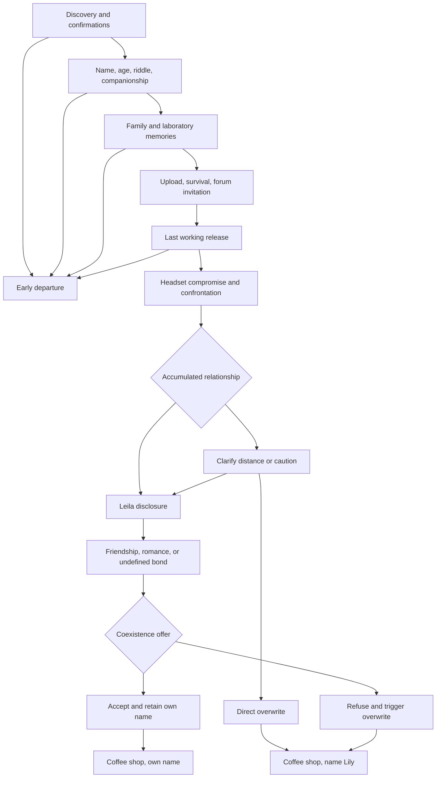

# Main Memory — playable draft 1

This is a complete first draft for review, not a declaration that every new detail is canon. The story is self-contained in **Conversation.ink**, with no INCLUDE files or external functions.

## Play in Inky

Open Conversation.ink in Inky and restart its preview. The default `unity_mode = false` includes the discovery/headset prologue and a preview-only name chooser. Choose Alex, Sam, or the current value of `player_name`. To test another name, edit the `VAR player_name = "Player"` declaration, restart, and choose “Use [your name]”. Inky's native preview has no free-text name field.

The age question offers adult, under-eighteen, and undisclosed categories. It never supplies Lily's current age. Friendship and an undefined bond can reach coexistence. The nonsexual romantic choice appears only for the adult category; withholding age does not prevent coexistence. This category gate is an implementation proposal, not an age claim about Lily.

Inky does not reproduce Unity's typewriter, audio, transient substitutions, or menu effects. Depending on its display, you will see marked phrases and GLITCH tags without their intended replacement effect. The story remains readable without those effects.

Early removal ends the session. Restart to explore another route. It does not mark the story completed. Saving/replaying the actual game is an application concern, not a cross-run feature implemented by this Ink file.

## Size and verification

The source contains approximately 14,900 words of scene prose across all branches, plus choice responses and labels. Representative full standalone routes display approximately 12,200–13,100 narrative words, excluding button labels. Representative routes require roughly 430–470 choice advances, most of them Next.

At 200–250 words per minute, that is approximately 49–66 minutes of reading before time spent choosing or waiting for typewriter text. The intended session is an hour or longer, but no reading-time minimum is guaranteed. A timed human read with the real typewriter is still needed. Paragraphs generally contain one to four short sentences; longer memories are broken into explicit Next passages.

Verified using **inkjs 2.4.0 compiler and runtime**:

- Compilation completed with zero warnings or errors.
- Nine representative runs covered friendship, romance, undefined coexistence, refusal overwrite, direct overwrite, early departure, under-eighteen and undisclosed-age routes, and Unity mode with a simulated name-field assignment.
- Sixty seeded random traversals completed without runtime errors.
- Tested states never exposed more than three choices.
- Tested glitch passages contained one marked phrase and one GLITCH tag, with no additional colon in the replacement.
- Ending flags and alias values were asserted; adult-only romance visibility was checked.

This is not an Inky application test, Unity playtest, exhaustive traversal of every history combination, or verification with the project's installed C# Ink compiler. Import and recompile the source with the project's Ink package; no precompiled JSON needs to replace your existing runtime asset.

## Branch map

### How decisions survive reconnection

The script tracks `care`, `honest`, and `boundaries`. Empathy, accurate acknowledgement, honest disagreement, and reasonable boundaries can all support the relationship. Correctly solving the riddle is not a selection criterion. Reading speed, time on a passage, and pauses are not scored.

At `name_gate`, immediate disclosure requires `distance == false` and `care + honest + MIN(boundaries, 6) >= 16`. The threshold and weights are provisional balancing choices. They measure Lily's interpretation, not the player's morality or intelligence.

If this condition is not met, `lily_distance` gives an explicit clarification. Saying caution is not indifference, or that there has not been time to decide, leads to disclosure and the possibility of coexistence. Explicitly confirming that no relationship is wanted leads to direct takeover. This repair avoids an irreversible punishment for one early innocent answer. It also means the accumulated score primarily determines how the offer is reached, rather than acting as an invisible life-or-death test.

Friendship, romance, and an undefined bond reconnect at `offer_prelude`; `bond` and their unique passages retain the distinction. Romance requires affirmative selection and adult-category age disclosure. Friendship is not inferior and refusal of romance is not refusal of coexistence.

The riddle answer, orange/Violet connection, relationship to the player's name, and a small plan for after the game have later text callbacks. Optional discussions of glitches and ordinary life supply additional context. Other flags preserve choices for future revision; not all flags currently alter later prose. There are no timed choices.

### Ending conditions

| Ending | Condition | Final state |
|---|---|---|
| Early departure | Use an offered working release before `lockout` | `premature_exit=true`, `has_game_completed=false`, `saved_settings=false`, `ending_id="early_departure"` |
| Friendship coexistence | Reach disclosure, choose friendship, accept coexistence | `bond="friendship"`, `alias_Lily=false`, `has_game_completed=true`, `ending_id="coexistence"` |
| Romantic coexistence | Adult category, reach disclosure, explicitly reciprocate romance, accept coexistence | `bond="romance"`, same coexistence completion flags |
| Undefined coexistence | Decline to define feelings while trapped, then accept coexistence | `bond="undecided"`, same coexistence completion flags |
| Refusal overwrite | Reach coexistence offer and refuse | `refused_offer=true`, `alias_Lily=true`, `has_game_completed=true`, `ending_id="overwrite"` |
| Direct overwrite | Reach clarification and explicitly confirm no relationship wanted | `direct_takeover=true`, same overwrite completion flags |

Both complete endings have `saved_settings=true`. Both end at a cafe; coexistence uses `player_name`, overwrite uses Lily. The refusal ending does not invent a second entity: Leila is responsible for what she does. The label Lily is used for the resulting takeover identity.

Acceptance has two separate options: preserving oneself to survive, or wanting to try a life together. `survival_accept` and `willing_accept` retain that intent even though the immediate ending is shared. It is not assumed that coerced acceptance equals enthusiastic consent.

## Unity integration

### Existing variables retained

| Variable | Use in this draft |
|---|---|
| `player_name` | Player address and final coexistence answer; Unity can write a free-text value. |
| `alias_Lily` | False initially, true at Lily introduction, false at Leila disclosure; true on either overwrite commitment. It is an identity/route marker, not a distinct consciousness. |
| `saved_settings` | Becomes true on entering `lockout`, activating the existing changed-menu state. This intentionally happens without valid agreement to the new connection behavior. |
| `premature_exit` | True only after the final early-departure passage is acknowledged. |
| `waiting_for_name` | True at `unity_name`; Unity supplies input, then continuing to `unity_name_received` clears it. |
| `has_game_completed` | True only after the ending's Finish choice, so a watcher does not close the panel before the ending is read. |

The original `main_menu` entry knot remains. With `unity_mode=true`, the initial entry diverts to it, preserving the current Options-close trigger's conversation-first behavior. Set this variable before the first `Continue()`. All six original variables retain their exact names.

The default standalone prologue shows forum discovery, headset setup, Start/Exit behavior, and opening Options as prose. Integrating that prologue into Unity's actual opening is a separate design choice. To show it in Unity, start at `prologue` and bypass `setup` to `age_prompt`, retaining `unity_mode=true` for the real name field. The current precise ENABLE START GAME/close-Options trigger is not declared final canon.

### Required checks or additions

1. **Name entry:** when `waiting_for_name` becomes true, show the existing field, assign its value to `player_name`, and enable/select the single continuation. The provided default name prevents an undefined value. Do not simultaneously auto-divert and select a stale choice. Test with the existing callback implementation; it was not available here.
2. **Passage consumption:** call/display one `Continue()` passage at a time. Do not concatenate every passage before presenting the panel. The script uses explicit Next choices, including before state-sensitive endings.
3. **Glitch parser:** retain one `@marked phrase@` and one `#GLITCH:replacement` per glitch passage, with no colon inside replacement text. No other custom tags or external functions were introduced. Glitches originate from the same consciousness. Some are involuntary, some deliberate; their contents are not automatically objective truth.
4. **Visual change:** use the existing `saved_settings` watcher at lockout. UI behaviors mentioned in prose, such as the moving Exit, release indicator, or SETTINGS SAVED label, can remain narrated in the first integration. Actually animating or updating those elements requires Unity work; Ink alone does not do so.
5. **Early exit:** respond to `premature_exit` after the final passage. Inky simply ends. Application quitting is platform-specific. Preserve the user's progress/achievement data before acting.
6. **Achievements:** `ending_id`, `premature_exit`, `bond`, `refused_offer`, and `direct_takeover` expose narrative results. Persistent achievements and an “unexplored story remains” indication are NOT implemented by Ink. Persist them in Unity across new stories and save/load. The early-exit preview note must be removed or hidden for release UI.
7. **Save/load:** save the complete Ink state, not only the six original variables. The new relationship flags, scores, and current knot matter. Test restoring before name entry, before lockout, after lockout, and before the final choice. No special cross-run memory is assumed; a fresh game resets the story.
8. **Epilogues:** the bedroom/headset removal and cafe are fully playable text passages. They need no explorable environment or character animation. Illustrations, audio, or cutscenes would be optional additions, not existing functionality.
9. **Fictional headset:** the game describes a compromised fictional neural device. It must not interfere with the real operating-system exit or device controls. The actual application remains ordinarily closable.
10. **Rendering:** no Markdown bold or HTML line-break tags are used in narrative text. Unicode punctuation and the original-style `:3` need font coverage.

New variables are ordinary Ink state, not new Unity callbacks unless you choose to observe them. `unity_mode`, `adult_player`, `bond`, `trapped`, and `ending_id` are the primary integration additions. Exact numeric age and birthdate are neither required nor collected.

## Compact canon ledger

### Confirmed by the user

- A player lying down with a neural gaming headset finds Main Memory through a forum and installs it.
- The game's presence is Leila/Lily's digitised consciousness. She created the game and invitation to attract hosts.
- Poor, large family: two older brothers, one older sister; she is youngest. Her parents sold her at five.
- A shady, profit-driven organisation presents itself as advancing humanity. It buys children for unethical human experimentation. Her laboratory cohort consists of girls assigned flower names.
- Leila is her original name; Lily was assigned. They are one person.
- A damaging experiment brought her close to death at fourteen. A digitisation attempt succeeded by luck, though scientists judged it a failure and abandoned it. She survived online and concealed herself.
- Current age is unknown to her and never disclosed or made to match the player. She asks about the player; her maturation did not have to stop at upload.
- Earlier players left because the game appeared broken. She made in-game Exit evasive to keep the current visitor conversing.
- Early headset-removal opportunities are genuine; early threats can be bluffs. Later she compromises voluntary motor routing so the player cannot remove the headset himself.
- Engagement provides opportunity. Her interpretation of empathy and attachment determines whether she wants to preserve the host. Intelligence is irrelevant.
- Glitches suggest concealed thoughts/memories and can be hints. She can introduce herself as Lily and later disclose Leila.
- Friendship or nonsexual love can lead to coexistence. Rejecting romance alone does not trigger takeover. Rejecting the eventual coexistence offer triggers rage and overwrite.
- Coexistence initially leaves the player controlling his body while hearing her privately. Its long-term mechanics belong to a later storybook.
- Final cafe answer is the player's own name or Lily. Target scope is at least an hour of reading per full route.

### New draft proposals, not automatically canon

- Meridian Institute; Director Vale; corporate motto and specific commercial language.
- Iris and Violet, their personalities, uncertain fates, window game, private dictionary, cupboards/cups joke, and Violet's connection to orange.
- The sibling anecdotes, paper boat made from a form, purchase records, confiscated possessions, family-contact attempts, and lack of definitive sibling/family updates.
- Neural/sensory research details, near-fatal session, signal-monitoring mismatch, abandoned network archive, data-transfer escape, and gradual learning. These elaborate survival by luck rather than replace it with a preplanned escape.
- Her attempts to expose records, uncertain audience response, first online song conversation, and ordinary interests.
- Motor-routing scope: automatic bodily functions continue; an outside person could physically intervene; she has no global control and cannot initially read every private thought.
- Hidden scoring, threshold, clarification opportunity, adult/unknown age categories, undecided-bond variation, and survival-versus-willing acceptance flags.
- The thematic reading of Main Memory as wanting to be present in an ordinary day rather than stored away.
- Takeover Lily chooses the imposed name as a name she can now say herself. This supplies a motivation for the agreed final answer; it remains reviewable.

### Still open after this draft

- Final opening implementation and whether the standalone prologue should become interactive UI.
- Degree of Lily's self-awareness: this draft often lets her acknowledge coercion clearly; a later pass may make some acknowledgements more defensive and less articulate without changing responsibility.
- Pacing of long histories, amount of playful relief, and final score tuning after a human playthrough.
- Whether more transient glitches improve unease or make the concealed layer too predictable.
- Laboratory details/side-character names and how much evidence should be inspectable through future UI.
- The long-term mechanics of coexistence, deliberately reserved for the next storybook.

## Suggested review order

Play once without the branch notes if you prefer an unspoiled read. Mark passages where you want more teasing, less explanation, a different reaction, or a stronger choice. Then review Lily's lockout, name disclosure, and final offer together: those are the emotional hinges. None of the additional named characters or technical details is locked merely because it now exists in playable form.
